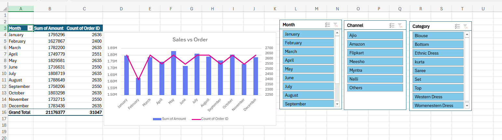
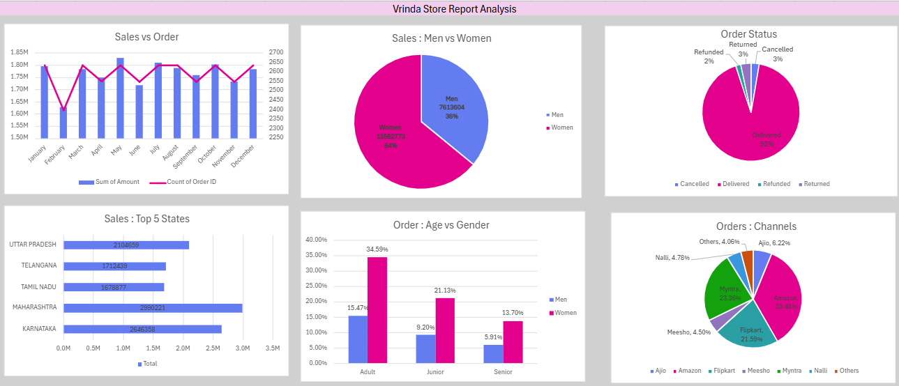

# 🛍️ Vrinda Shop 2022 Sales Analysis Dashboard | Excel Data Visualization Project

This project presents a **comprehensive yearly sales analysis** for **Vrinda Shop (2022)**, built entirely in **Microsoft Excel** using Pivot Tables, Charts, and interactive Slicers.  
The goal is to uncover business insights and recommend strategies to improve sales performance.

---

## 📊 Project Overview

An interactive **Excel Dashboard** was designed to analyze Vrinda Shop’s 2022 sales performance from multiple perspectives — including monthly trends, customer demographics, regional contribution, and channel performance.

---

## 🔍 Business Questions Addressed

1. 📈 Compare total **Sales and Orders** in a single chart.  
2. 🗓️ Which **month** recorded the **highest sales and orders**?  
3. 👩‍🦰 Who purchased more — **Men or Women** in 2022?  
4. 📦 What are the different **Order Status** categories (Delivered, Cancelled, Refunded, Returned)?  
5. 🌍 List the **Top 10 States** contributing to total sales.  
6. 👨‍👩‍👧 What is the **relationship between Age and Gender** based on order count?  
7. 🛒 Which **online channel** contributes the most to sales (Amazon, Flipkart, Myntra, etc.)?  
8. 🎯 What is the **highest-selling product category**?

---

## 💡 Key Insights

- 👩‍🦰 **Women** customers contributed approximately **65%** of total purchases.  
- 🌆 **Maharashtra, Karnataka, and Uttar Pradesh** were the **top 3 states** by sales.  
- 👨‍👩‍👧 **Adults (30–49 years)** contributed nearly **50%** of total orders.  
- 🛍️ **Amazon, Flipkart, and Myntra** were the **leading sales channels**.  
- 💹 Consistent mid-year growth indicates strong seasonal buying trends.

---

## 🧠 Final Conclusion

To improve Vrinda Shop’s sales performance:

> 🎯 **Target women customers aged 30–49 years** living in **Maharashtra, Karnataka, and Uttar Pradesh**,  
> 💰 by offering **ads, coupons, and promotions** through **Amazon, Flipkart, and Myntra** platforms.

---

## ⚙️ Tools & Techniques Used

- **Microsoft Excel**
  - Pivot Tables & Pivot Charts  
  - Column, Pie, and Bar Graphs  
  - Interactive Slicers  
  - Dashboard formatting & layout design  

---

## 📂 Project Files

| File Name | Description |
|------------|-------------|
| `VrindaStoreSalesAnalysis_Project.xlsx` | Main Excel dashboard and analysis file |
| `Sales_Data.csv` | Cleaned sales dataset used for analysis |
| `README.md` | Project documentation |

---

## 📸 Dashboard Preview

  
  

---

## 🧾 Author

**Rishabh Shukla**  
🎓 B.Tech Civil Engineering, IIT (ISM) Dhanbad  
📧 [rishabhshukla9140@gmail.com](mailto:rishabhshukla9140@gmail.com)  
🔗 [LinkedIn Profile](https://www.linkedin.com/in/rishabhshukla192/)  

⭐
